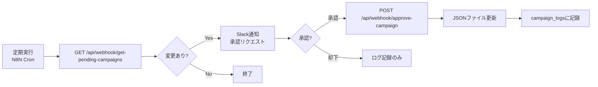

# Campaign Management Workflow

このドキュメントでは、キャンペーン自動更新システムの使い方を説明します。

## システム概要



## コンポーネント

### 1. データベーススキーマ

`campaign_logs` テーブルでキャンペーンの変更履歴を管理します。

```bash
# スキーマを適用
psql "$DATABASE_URL" -f sql/campaign_logs_schema.sql
```

### 2. スクリプト

#### `fetch-campaigns.mjs`
- 各スクールのキャンペーン終了日をチェック
- 期限切れまたは3日以内に期限切れになるキャンペーンを検出
- 検出結果をJSON形式で出力

```bash
# 手動実行
npm run fetch:campaigns
```

#### `update-campaign.mjs`
- 指定されたスクールのキャンペーンデータを更新
- JSONファイルとデータベースを更新

```bash
# 手動実行例
npm run update:campaign -- kimini '{"campaignText":"【〜2月28日】初月50%OFF","campaignEndsAt":"2026-02-28"}'
```

### 3. APIエンドポイント

#### `GET /api/webhook/get-pending-campaigns`
N8Nが定期的に呼び出して、承認待ちのキャンペーン変更を取得。

```bash
curl -X GET https://your-domain.com/api/webhook/get-pending-campaigns \
  -H "Authorization: Bearer YOUR_WEBHOOK_SECRET"
```

**レスポンス例:**
```json
{
  "timestamp": "2026-02-12T06:00:00.000Z",
  "totalSchools": 9,
  "changesDetected": 2,
  "changes": [
    {
      "schoolId": "kimini",
      "schoolName": "Kimini英会話",
      "currentCampaign": {
        "campaignText": "【〜1月31日】特典：TOEIC講座無料",
        "campaignEndsAt": "2026-01-31"
      },
      "status": "expired",
      "daysUntilEnd": -12,
      "officialUrl": "https://kimini.online"
    }
  ]
}
```

#### `POST /api/webhook/approve-campaign`
Slack承認後にN8Nが呼び出して、キャンペーンデータを更新。

```bash
curl -X POST https://your-domain.com/api/webhook/approve-campaign \
  -H "Authorization: Bearer YOUR_WEBHOOK_SECRET" \
  -H "Content-Type: application/json" \
  -d '{
    "schoolId": "kimini",
    "campaignData": {
      "campaignText": "【〜2月28日】初月50%OFF",
      "campaignEndsAt": "2026-02-28",
      "benefitText": "初月50%OFF"
    },
    "approvedBy": "U12345678",
    "slackMessageTs": "1234567890.123456"
  }'
```

## N8Nワークフロー設定

### ワークフロー1: 定期チェック

1. **Schedule Trigger** (Cron)
   - 実行頻度: 毎日午前9時など

2. **HTTP Request** - 変更取得
   - Method: GET
   - URL: `https://your-domain.com/api/webhook/get-pending-campaigns`
   - Headers: `Authorization: Bearer ${YOUR_WEBHOOK_SECRET}`

3. **If** - 変更があるかチェック
   - Condition: `{{ $json.changesDetected > 0 }}`

4. **Split In Batches** - 各変更を処理
   - Batch Size: 1

5. **Slack** - 承認リクエスト送信
   - Channel: `#campaign-approvals`
   - Message:
   ```
   🔔 キャンペーン更新の承認リクエスト
   
   **スクール**: {{ $json.schoolName }}
   **現在のキャンペーン**: {{ $json.currentCampaign.campaignText }}
   **終了日**: {{ $json.currentCampaign.campaignEndsAt }}
   **ステータス**: {{ $json.status }}
   
   公式サイトを確認して、新しいキャンペーン情報を入力してください:
   {{ $json.officialUrl }}
   ```
   - Blocks: 承認/却下ボタンを追加

### ワークフロー2: Slack承認処理

1. **Slack Trigger** - ボタンクリックをトリガー
   - Action: Button Click

2. **If** - 承認/却下を判定
   - Condition: `{{ $json.actions[0].value === 'approve' }}`

3. **Code** - キャンペーンデータを整形
   ```javascript
   // ユーザーがSlackのモーダルで入力した内容を取得
   const campaignData = {
     campaignText: $input.item.json.view.state.values.campaign_text.value,
     campaignEndsAt: $input.item.json.view.state.values.end_date.value,
     benefitText: $input.item.json.view.state.values.benefit_text.value,
     campaignBullets: $input.item.json.view.state.values.bullets.value.split('\n')
   };
   
   return {
     schoolId: $input.item.json.metadata.school_id,
     campaignData,
     approvedBy: $input.item.json.user.id,
     slackMessageTs: $input.item.json.message.ts
   };
   ```

4. **HTTP Request** - 更新実行
   - Method: POST
   - URL: `https://your-domain.com/api/webhook/approve-campaign`
   - Headers: 
     - `Authorization: Bearer ${YOUR_WEBHOOK_SECRET}`
     - `Content-Type: application/json`
   - Body: `{{ $json }}`

5. **Slack** - 完了通知
   - Message: `✅ キャンペーンを更新しました`

## データベースクエリ例

### 最近の変更履歴を確認
```sql
SELECT 
  id,
  created_at,
  school_id,
  action,
  approved_by,
  old_campaign_data->>'campaignText' as old_campaign,
  new_campaign_data->>'campaignText' as new_campaign
FROM campaign_logs
ORDER BY created_at DESC
LIMIT 20;
```

### スクール別の変更履歴
```sql
SELECT 
  created_at,
  action,
  old_campaign_data->>'campaignEndsAt' as old_end_date,
  new_campaign_data->>'campaignEndsAt' as new_end_date,
  approved_by
FROM campaign_logs
WHERE school_id = 'kimini'
ORDER BY created_at DESC;
```

## トラブルシューティング

### エラー: "Unauthorized"
- `WEBHOOK_SECRET` 環境変数が設定されているか確認
- N8NのAuthorizationヘッダーが正しいか確認

### エラー: "Failed to parse script output"
- `DATABASE_URL` が正しく設定されているか確認
- `npm run fetch:campaigns` を手動実行してエラーを確認

### キャンペーンが更新されない
- ファイルの書き込み権限を確認
- `campaign_logs` テーブルにログが記録されているか確認
```sql
SELECT * FROM campaign_logs ORDER BY created_at DESC LIMIT 5;
```

### 検出されない期限切れキャンペーン
- JSONファイルの `campaignEndsAt` フォーマットを確認 (YYYY-MM-DD)
- タイムゾーンの違いを考慮

## セキュリティ

- `WEBHOOK_SECRET` は強力なランダム文字列を使用
- APIエンドポイントは必ずHTTPSで公開
- Slack Appの検証トークンも適切に設定
- データベース接続文字列を環境変数で管理
